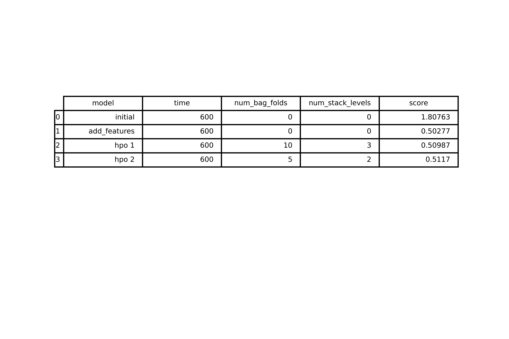
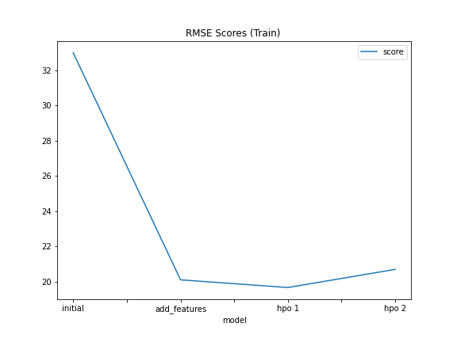
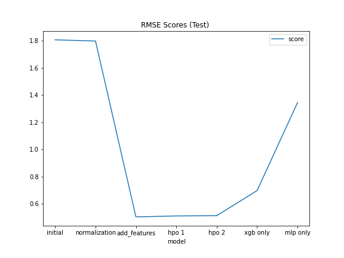

# Report: Predict Bike Sharing Demand with AutoGluon Solution
#### Gracelyn Shi

## Initial Training
### What did you realize when you tried to submit your predictions? What changes were needed to the output of the predictor to submit your results?
There was an error because some of the predictions were negative values. I had to change all the negative values to zero to submit the results.

### What was the top ranked model that performed?
The weighted ensemble model (L3) - stack level 3.

## Exploratory data analysis and feature creation
### What did the exploratory analysis find and how did you add additional features?
The dataset was generally well balanced in terms of the date-time, season, temperature and humidity, however it was imbalanced for working day, windspeed, and holiday which is understandable since those categories tend to have less occurrences. 

In terms of correlation for the individual features and the count, the temperature had the highest correlation with the count at around 0.4. 

I normalized the fields for temperature(s), humidity and windspeed so the values were from 0-1. 

I also changed the season and weather features into categorical features, and seperated the datetime feature into separate year, month, day, hour, and minute fields.

### How much better did your model perform after adding additional features and why do you think that is?
The model performed much better, it went from 1.8 RMSE to 0.5. Changing the season and weather features into categories definitely improved the score since the integer representation (1-4) represents a scale or a value, which doesn't match the information conveyed by those features. Since season and weather intuitively makes a huge difference in biking, it likely helped the model greatly in predicting the minutiae of the predicted count.

## Hyper parameter tuning
### How much better did your model preform after trying different hyper parameters?
The model ended up performing worse when I increased the stack levels and bag folds. This means the model was better at selecting these hyperparameters than I was, which was the original intent of AutoGluon.

### If you were given more time with this dataset, where do you think you would spend more time?
I would increase the time the model trains, as well as investigate more into the features (feature engineering). 

What was interesting is that for the feature importance table for the best performing model, hour, month, working day, and year were the most significant factors in predicting the counts. Humidity actually ranked quite high as well (5th) which is quite interesting as it is not as intuitive. I would spend more time on generating feature importance tables and potentially combine or drop features to decrease training time and improve accuracy.

### Create a table with the models you ran, the hyperparameters modified, and the kaggle score.

### Create a line plot showing the top model score for the three (or more) training runs during the project.

### Create a line plot showing the top kaggle score for the three (or more) prediction submissions during the project.

TODO: Replace the image below with your own.

## Summary
The model performed the best with added features and no hyperparameter tuning. The best models were those that were combination of various models, as it is AutoGluon's main offering. 

